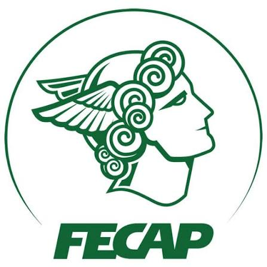

<h1 align="center">Olá, eu sou Paulo Marcelli</h1>

  Estudante de <strong>Análise e Desenvolvimento de Sistemas (ADS)</strong> na <a href="https://www.fecap.br/">FECAP</a> e professor de inglês e espanhol.

## Sobre mim

- Atualmente, curso **Análise e Desenvolvimento de Sistemas (ADS)** na **FECAP**.
- Atuei por **3 anos como professor de inglês e espanhol na Fisk**.
- Estou desenvolvendo minha trajetória na tecnologia, unindo raciocínio lógico, comunicação e experiência em ensino.
- Tenho interesse em aprender, criar projetos e evoluir continuamente na área de desenvolvimento de sistemas.

## Formação e experiência

| Área | Instituição | Status / período |
| --- | --- | --- |
| Análise e Desenvolvimento de Sistemas | [FECAP](https://www.fecap.br/) | Em andamento |
| Ensino de inglês e espanhol | [Fisk](https://www.fisk.com.br/) | 3 anos de experiência |

  
  

## Objetivos

Busco ampliar meus conhecimentos em desenvolvimento de software e participar de projetos que transformem ideias em soluções úteis, combinando tecnologia com comunicação clara e aprendizado contínuo.

  <a href="https://www.fecap.br/">FECAP</a> · <a href="https://www.fisk.com.br/">Fisk</a>

